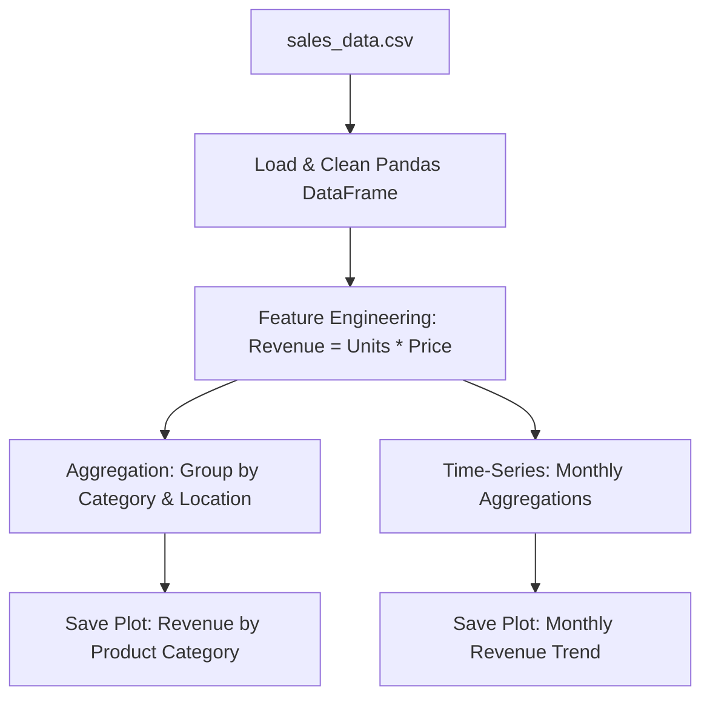

# Project 1: Sales Performance Analysis (EDA)

## Project Objective
The objective of this project is to perform Exploratory Data Analysis (EDA) on a transactional sales dataset to discover patterns in purchasing behavior, track monthly revenue growth trends, and identify high-performing product categories and store locations.

## Problem Statement
A retail chain wants to understand its sales dynamics to optimize inventory stocking, allocate marketing budgets to high-performing areas, and identify under-performing categories that require promotional discounts.

## Dataset
* **Name**: `sales_data.csv` (located in the `datasets/` folder)
* **Size**: 200 transaction rows
* **Features**:
  * `Transaction_ID`: Unique integer identifier.
  * `Date`: Date of purchase (YYYY-MM-DD).
  * `Product_Category`: Categorical field (Electronics, Clothing, Home & Kitchen, Books, Sports).
  * `Units_Sold`: Integer count of units purchased.
  * `Unit_Price`: Numeric price of a single unit.
  * `Store_Location`: Categorical field (New York, Los Angeles, Chicago, Houston, Miami).

## Technologies Used
* **Python**: Core programming language.
* **Pandas**: Data load, clean, group, and feature engineering.
* **NumPy**: Numeric arrays math.
* **Matplotlib / Seaborn**: Visualizing metrics and saving charts to file.

## Architecture


## Workflow
1. **Data Load**: Load sales CSV into a Pandas DataFrame.
2. **Feature Engineering**: Compute `Revenue = Units_Sold * Unit_Price` for each row.
3. **Product & Location Analysis**: Group revenue aggregates by Category and Location.
4. **Time Series Trend**: Parse dates, group revenues by month, and track monthly sales.
5. **Visualization**: Save static PNG plots of the sales distributions.
6. **Profiling Report**: Print summary insights to the console.

## How to Run
1. Generate the datasets first (if not already done):
   ```bash
   python ../datasets/generate_mock_datasets.py
   ```
2. Run the EDA script:
   ```bash
   python eda_sales.py
   ```

## Results
* Identified **Electronics** and **Home & Kitchen** as the highest revenue-generating product categories.
* Identified regional distribution splits showing that **New York** and **Los Angeles** drive the largest sales volume.
* Tracked monthly sales trends revealing peak seasonal months.

## Future Improvements
* Integrate external weather API coordinates to see if rainfall or temperature correlates with category demand (e.g. sports gear during summer).
* Implement predictive forecasting models (like ARIMA or Prophet) to forecast sales volume limits for the next 30 days.
