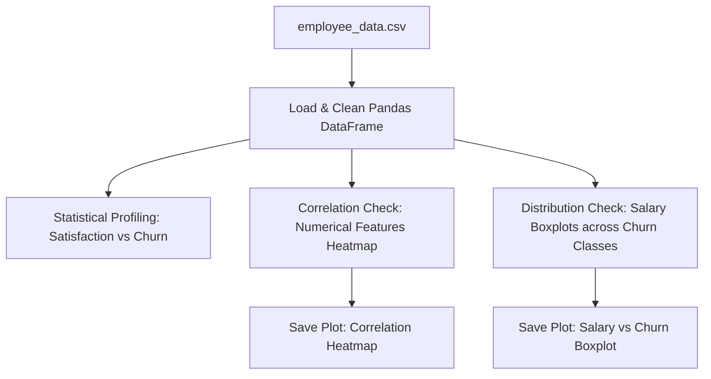

# Project 2: Employee Retention and Churn Profiling (EDA)

## Project Objective
The objective of this project is to perform Exploratory Data Analysis (EDA) on an employee demographic and satisfaction dataset to discover key drivers of employee attrition (churn), analyze correlation patterns, and profile at-risk groups.

## Problem Statement
High employee turnover results in significant recruitment costs, loss of institutional knowledge, and projects delays. The HR department wants to identify what factors (e.g. salary, tenure, satisfaction, age) are correlated with attrition to deploy proactive retention programs.

## Dataset
* **Name**: `employee_data.csv` (located in the `datasets/` folder)
* **Size**: 150 employee records
* **Features**:
  * `Emp_ID`: Unique integer identifier.
  * `Age`: Employee age.
  * `Department`: Categorical field (HR, Engineering, Sales, Marketing, Finance).
  * `Years_At_Company`: Years of service at the firm.
  * `Satisfaction_Score`: Numerical score from 1 (low) to 10 (high).
  * `Monthly_Salary`: Employee monthly salary.
  * `Churn_Status`: Binary target variable (1 = Left Company, 0 = Stayed).

## Technologies Used
* **Python**: Core programming language.
* **Pandas**: Data load, filter summaries, and transformations.
* **NumPy**: Matrix arrays math.
* **Matplotlib / Seaborn**: Visualizing distribution trends, correlations, and saving plots.

## Architecture


## Workflow
1. **Data Load**: Load employee CSV into a Pandas DataFrame.
2. **Descriptive Profiling**: Compare means of key metrics (Age, Satisfaction, Salary) grouped by Churn_Status.
3. **Correlation Analysis**: Compute a correlation matrix for numerical values to trace linear associations.
4. **Distribution Profiling**: Plot satisfaction histograms and salary distributions using boxplots.
5. **Visualization**: Save static PNG plots of the correlation heatmaps, satisfaction spreads, and salary distributions.
6. **Key Risk Profiling**: Identify segments with the highest probability of leaving.

## How to Run
1. Generate the datasets first (if not already done):
   ```bash
   python ../datasets/generate_mock_datasets.py
   ```
2. Run the EDA script:
   ```bash
   python eda_retention.py
   ```

## Results
* Identified **Satisfaction_Score** as the primary driver of attrition; employees with scores below 5 show significantly higher churn.
* Salary distributions show a clear disparity: churned employees typically fall in the lower salary quartile of their respective departments.
* Tenure correlation highlights a "two-year itch", where employees with 1-2 years of experience exhibit higher turnover.

## Future Improvements
* Build a machine learning classification model (like Logistic Regression or Random Forest) to output a probability of churn for active employees.
* Deploy a web-based dashboard using Streamlit to allow interactive HR profiling.
